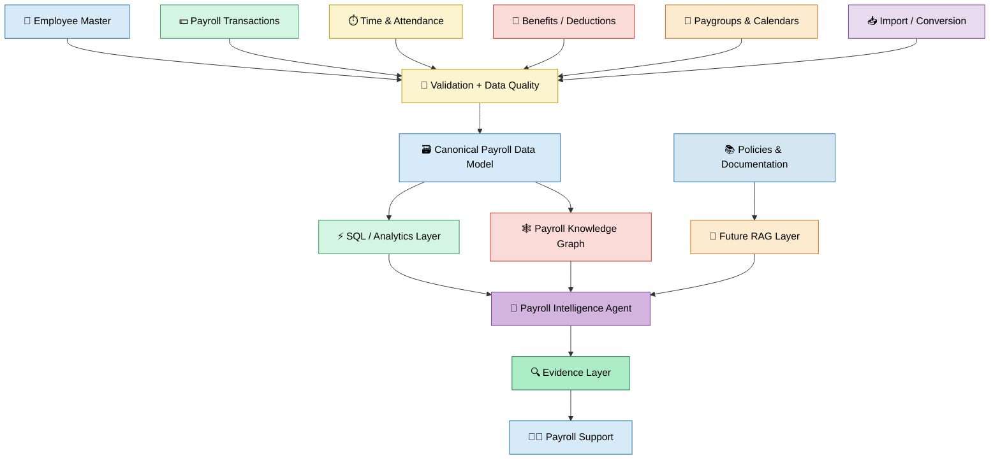
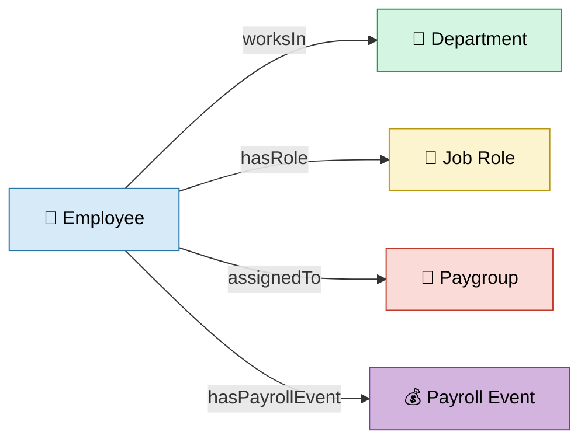
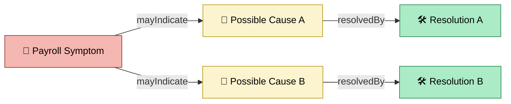
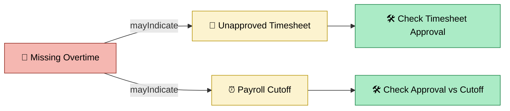
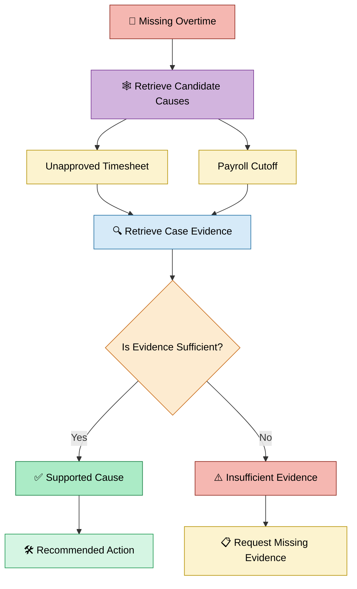
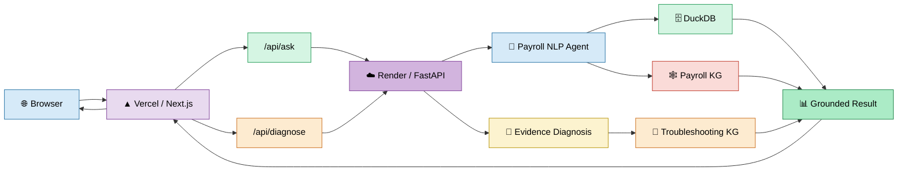
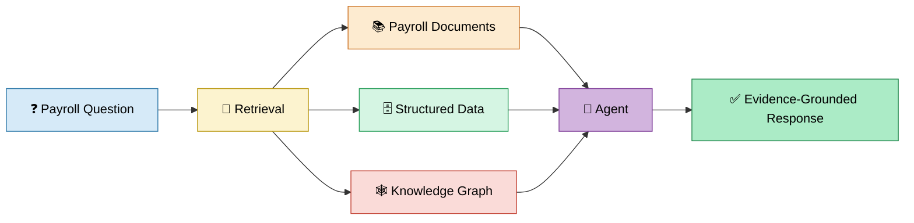
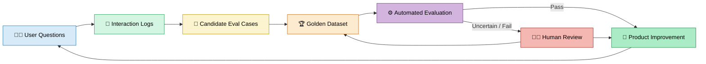
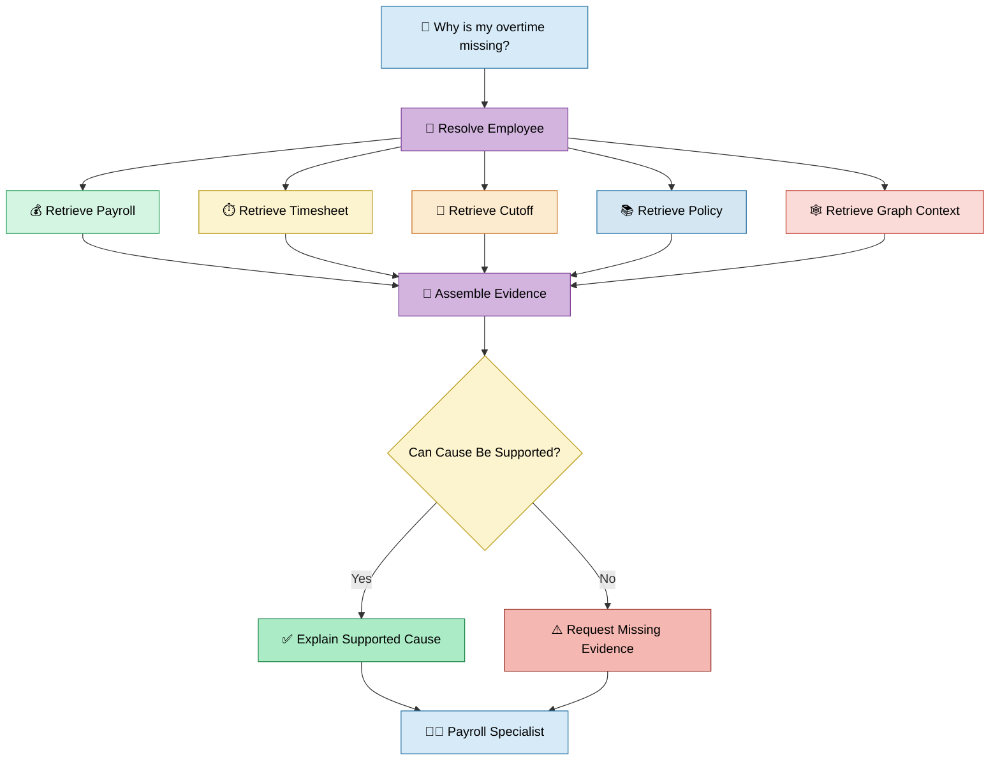

# Payroll Intelligence AI Agent
## Product Requirements Document (PRD)

**Product:** Payroll Intelligence AI Agent  
**Platform:** PayrollKG  
**Document Type:** Product Requirements Document  
**Status:** Working Portfolio Prototype  
**Version:** 1.0  
**Last Updated:** September 2026  

### Live Product

**[Launch Payroll Intelligence AI Agent](https://kg-payroll-research.vercel.app/ai-agent)**

---

# 1. Executive Summary

Payroll Intelligence AI Agent is an evidence-grounded payroll investigation experience designed to help payroll support and operations teams answer payroll questions and investigate payroll issues from one interface.

Payroll investigations frequently require users to combine information from multiple sources:

- Employee master data
- Payroll transactions
- Earnings
- Overtime
- Deductions
- Paygroups
- Organizational data
- Timesheets
- Approval records
- Payroll calendars
- Import/load information
- Payroll policies
- Troubleshooting documentation

The Payroll Intelligence AI Agent creates an intelligence layer across these sources.

Instead of requiring the user to know where the data lives or how to query it, the target experience is:

**Ask a payroll question → retrieve authoritative data → understand relationships → assemble evidence → answer or diagnose → expose supporting evidence.**

The current prototype demonstrates this concept using synthetic payroll data, DuckDB, a payroll Knowledge Graph, deterministic intent handling, evidence-based diagnosis, evaluation datasets, FastAPI, Next.js, Vercel, and Render.

The product is designed around one core principle:

> **The system should not provide a payroll conclusion that exceeds the available evidence.**

When sufficient evidence exists, the system provides a grounded answer or diagnosis.

When evidence is insufficient, the system should abstain and identify what information is still required.

---

# 2. Problem Statement

## 2.1 The User Problem

Payroll support specialists frequently receive questions such as:

- Why is my overtime missing?
- Why did my net pay change?
- What was my gross pay?
- Why am I assigned to this paygroup?
- Why is an employee missing from a payroll report?
- Was an employee paid twice?
- Are there anomalies in this employee's payroll?
- Which payroll events contributed to this amount?

Answering these questions can require investigation across several systems and datasets.

A support specialist may need to:

1. Identify the employee.
2. Find the relevant payroll period.
3. Retrieve payroll transactions.
4. Review earnings.
5. Review overtime.
6. Check timesheet status.
7. Check approval timestamps.
8. Check payroll cutoff dates.
9. Validate employee/paygroup assignments.
10. Review imports or load history.
11. Review policies.
12. Compare the evidence.
13. Determine whether a cause can actually be established.

The challenge is therefore not simply **finding a payroll record**.

The challenge is **assembling the right evidence and relationships required to answer the user's question correctly.**

---

# 3. Why Build Payroll Intelligence?

Traditional payroll systems are primarily optimized for transaction processing and record management.

Investigation is a different problem.

A database may tell us:

**EMP-00001 has 115 overtime hours.**

But a payroll investigation may require understanding:

- Which payroll events contain those hours?
- Which employee does the record belong to?
- Which department and role are associated with the employee?
- Which paygroup applies?
- Whether the overtime was approved.
- Whether approval occurred before payroll cutoff.
- Whether a payroll policy affected the payment.
- Whether a data-load problem occurred.
- Whether enough evidence exists to identify a root cause.

Payroll Intelligence adds a reasoning and investigation layer over payroll information.

---

# 4. Product Vision

The long-term vision is to create a unified payroll investigation assistant where a support specialist can ask:

> **Why is this employee's overtime missing?**

and the system can safely perform an investigation such as:

```text
Understand Question
        ↓
Identify Employee
        ↓
Retrieve Payroll Records
        ↓
Retrieve Relevant Relationships
        ↓
Retrieve Timesheet / Approval Evidence
        ↓
Retrieve Payroll Cutoff / Policy
        ↓
Evaluate Evidence
        ↓
Explain Finding
        ↓
Recommend Next Action
```

The objective is not to create an AI system that guesses payroll answers.

The objective is to create an **evidence-grounded investigation system** that helps a human reach the answer faster.

---

# 5. Product Principles

The product follows six principles.

### 1. Evidence First

Payroll answers should be grounded in retrieved information.

### 2. Relationships Matter

Payroll information should not be treated as isolated rows.

Employees, payroll events, departments, roles, paygroups, symptoms, causes, and resolutions have relationships.

### 3. Separate Facts from Diagnosis

A payroll fact such as:

**paid_overtime_hours = 0**

does not independently establish why overtime was missing.

### 4. Abstain When Necessary

When evidence is insufficient, the system should request additional information rather than manufacture a cause.

### 5. Make the Reasoning Inspectable

Users should be able to see the evidence used to generate an answer.

### 6. Continuously Evaluate

Agent behavior should be tested through repeatable evaluation cases.

---

# 6. Target Users

## 6.1 Payroll Support Specialist

### Needs

- Answer employee payroll questions.
- Investigate payment problems.
- Find supporting evidence quickly.
- Know what information is missing.

### Example Question

> Why didn't this employee receive overtime?

---

## 6.2 Payroll Operations Analyst

### Needs

- Analyze payroll transactions.
- Review paygroups.
- Investigate anomalies.
- Compare payroll events.
- Identify operational issues.

---

## 6.3 Implementation / Data Conversion Consultant

### Needs

- Investigate missing records.
- Validate mappings.
- Diagnose incorrect paygroups.
- Review source-to-target conversion issues.
- Investigate payroll data quality.

---

## 6.4 Payroll Product / Engineering Team

### Needs

- Understand recurring payroll problems.
- Analyze investigation patterns.
- Identify missing data.
- Improve troubleshooting workflows.
- Evaluate AI behavior.

---

# 7. Jobs to Be Done

### JTBD 1 — Payroll Question

**When** I receive a payroll question,

**I want** to ask it in natural language,

**so that** I do not need to manually write SQL or search multiple datasets.

---

### JTBD 2 — Supporting Evidence

**When** the system gives me an answer,

**I want** to understand which payroll records support it,

**so that** I can verify the result.

---

### JTBD 3 — Troubleshooting

**When** a payroll issue occurs,

**I want** to understand the possible causes and documented resolutions,

**so that** I know where to investigate.

---

### JTBD 4 — Root-Cause Investigation

**When** multiple causes are possible,

**I want** the system to compare them against case-specific evidence,

**so that** it does not incorrectly select a cause.

---

### JTBD 5 — Missing Evidence

**When** the available evidence cannot establish the cause,

**I want** the system to tell me what information is missing,

**so that** I know the next investigation step.

---

# 8. Product Experience

The Payroll Intelligence product currently contains two major workflows.

## Workflow A — Ask Payroll AI

The user asks a natural-language payroll question.

Examples:

- How much overtime did EMP-00001 work?
- What is EMP-00001's gross pay?
- What is the employee's net pay?
- Are there anomalies?
- Which department does this employee belong to?
- What is the employee's role?

The system retrieves payroll information and returns a grounded response.

---

## Workflow B — Evidence-Based Diagnosis

The user selects a payroll symptom and supplies investigation evidence.

The system evaluates the evidence and returns either:

### Outcome A

**SUPPORTED_BY_CASE_EVIDENCE**

or:

### Outcome B

**INSUFFICIENT_EVIDENCE**

If evidence is insufficient, the system provides the required follow-up information.

---

# 9. High-Level Product Architecture

```mermaid
flowchart LR

    USER["👩‍💼 Payroll Support User"]
    AGENT["🤖 Payroll Intelligence AI Agent"]
    INTENT{"🧠 Understand Intent"}

    SQL["🗄️ SQL / DuckDB"]
    KG["🕸️ Knowledge Graph"]
    TROUBLE["🔎 Troubleshooting Knowledge"]

    PAY["💰 Payroll Evidence"]
    REL["🔗 Employee & Payroll Relationships"]
    CAUSE["🧩 Candidate Causes"]

    EVIDENCE["🧠 Evidence Assembly"]
    CHECK{"Evidence Sufficient?"}

    ANSWER["✅ Grounded Answer / Diagnosis"]
    ABSTAIN["⚠️ Abstain + Request Evidence"]
    UI["💻 Payroll Intelligence UI"]

    USER --> AGENT
    AGENT --> INTENT

    INTENT --> SQL
    INTENT --> KG
    INTENT --> TROUBLE

    SQL --> PAY
    KG --> REL
    TROUBLE --> CAUSE

    PAY --> EVIDENCE
    REL --> EVIDENCE
    CAUSE --> EVIDENCE

    EVIDENCE --> CHECK

    CHECK -->|Yes| ANSWER
    CHECK -->|No| ABSTAIN

    ANSWER --> UI
    ABSTAIN --> UI

    style USER fill:#D6EAF8,stroke:#2874A6,color:#000
    style AGENT fill:#D2B4DE,stroke:#7D3C98,color:#000
    style INTENT fill:#FCF3CF,stroke:#B7950B,color:#000
    style SQL fill:#D5F5E3,stroke:#239B56,color:#000
    style KG fill:#FADBD8,stroke:#C0392B,color:#000
    style TROUBLE fill:#FDEBD0,stroke:#CA6F1E,color:#000
    style PAY fill:#D5F5E3,stroke:#239B56,color:#000
    style REL fill:#FADBD8,stroke:#C0392B,color:#000
    style CAUSE fill:#FDEBD0,stroke:#CA6F1E,color:#000
    style EVIDENCE fill:#D6EAF8,stroke:#2874A6,color:#000
    style CHECK fill:#FCF3CF,stroke:#B7950B,color:#000
    style ANSWER fill:#ABEBC6,stroke:#1E8449,color:#000
    style ABSTAIN fill:#F5B7B1,stroke:#922B21,color:#000
    style UI fill:#D2B4DE,stroke:#7D3C98,color:#000
```



---

# 10. What Data Does Payroll Intelligence Need?

The quality of Payroll Intelligence depends on the quality, completeness, freshness, and relationships of the underlying data.

A production implementation would require several categories of payroll information.

---

# 11. Employee Master Data

## Required Fields

Examples include:

- Employee ID
- Employee status
- Department
- Job role
- Location
- Work state
- Cost center
- Paygroup
- Employment type
- Effective dates

## Why It Is Needed

Employee master data establishes the identity and organizational context required for an investigation.

Without correct employee identity, payroll information could be associated with the wrong person or assignment.

---

# 12. Payroll Transaction Data

## Required Fields

Examples:

- Employee ID
- Payroll event ID
- Pay period
- Pay date
- Gross pay
- Net pay
- Regular earnings
- Overtime earnings
- Overtime hours
- Deductions
- Taxes
- Payment status

## Why It Is Needed

This is the primary factual source for payroll questions.

It allows the system to answer:

- How much was paid?
- When was it paid?
- How many payroll events exist?
- How much overtime was recorded?
- Were any events flagged?

---

# 13. Time and Attendance Data

## Potential Fields

- Employee ID
- Timesheet ID
- Regular hours
- Overtime hours
- Submission timestamp
- Approval status
- Approval timestamp
- Approver
- Work date

## Why It Is Needed

Payroll output alone may show that overtime was not paid.

It cannot necessarily explain why.

Timesheet information helps determine whether the overtime was submitted and approved.

---

# 14. Payroll Calendar and Cutoff Data

## Potential Fields

- Paygroup
- Payroll period
- Processing date
- Approval cutoff
- Payroll cutoff
- Pay date
- Next-cycle rules

## Why It Is Needed

An approved timesheet may still miss the current payroll if approval occurred after payroll cutoff.

This information is therefore critical for evidence-based diagnosis.

---

# 15. Paygroup Data

## Potential Fields

- Paygroup code
- Pay frequency
- Employee assignment
- Effective date
- Assignment source
- Previous assignment
- Mapping history

## Why It Is Needed

Paygroup problems can affect:

- Payroll frequency
- Processing
- Payroll calendars
- Eligibility
- Reporting

---

# 16. Deduction and Benefits Data

## Potential Fields

- Deduction code
- Deduction amount
- Benefit election
- Effective date
- Prior election
- Current election
- Tax withholding
- Change history

## Why It Is Needed

A decrease in net pay does not automatically establish the cause.

The system needs detailed deduction history to distinguish between:

- Benefits changes
- Tax changes
- Other deductions

---

# 17. Data Conversion / Import Data

## Potential Fields

- Source record
- Target record
- Mapping rule
- Import batch
- Load status
- Error log
- Rejected record
- Retry history
- Source-to-target field mapping

## Why It Is Needed

Some payroll problems originate upstream from payroll processing.

Examples include:

- Missing records
- Incorrect mappings
- Duplicate imports
- Failed loads
- Wrong paygroup assignments

---

# 18. Audit and Lineage Data

A production intelligence system should also know:

- Where the data originated.
- When it was loaded.
- Which transformation occurred.
- Which system changed the record.
- Whether the record is current.
- Whether a correction occurred.

This creates traceability between the AI response and the underlying source.

---

# 19. Policy and Documentation Data

Potential documents include:

- Payroll policies
- Overtime rules
- Payroll calendars
- Cutoff policies
- Paygroup documentation
- Benefits rules
- Troubleshooting guides
- Implementation documentation

These documents could eventually be accessed through a Retrieval-Augmented Generation layer.

---

# 20. Data Architecture



---

# 21. Why SQL?

SQL is appropriate for structured factual questions.

Examples:

- Sum overtime hours.
- Calculate gross pay.
- Calculate net pay.
- Count payroll events.
- Retrieve payroll periods.
- Find flagged records.

Example:

> What is EMP-00001's total gross pay?

This is fundamentally a structured aggregation problem.

The system should retrieve the answer from payroll data rather than rely on a language model to calculate or invent it.

---

# 22. Why a Knowledge Graph?

SQL is excellent for structured facts.

But payroll investigation also requires relationships.

For example:



The Knowledge Graph allows the system to retrieve context that extends beyond an isolated payroll transaction.

---

# 23. Troubleshooting Knowledge Graph

Payroll investigation introduces another graph:



The current troubleshooting graph contains:

- **5 symptoms**
- **12 causes**
- **12 resolutions**
- **53 triples**

Supported prototype symptoms:

1. Missing Overtime
2. Unexpected Deductions
3. Wrong Paygroup
4. Duplicate Payment
5. Missing Payroll Record

---

# 24. Example — Missing Overtime

The Knowledge Graph may identify two candidate causes:



However, the graph does **not** automatically choose one.

Evidence is required.

---

# 25. Evidence-Based Diagnosis

Suppose the evidence shows:

- Approved overtime = 8 hours
- Approval = September 4 at 4:00 PM
- Payroll cutoff = September 3 at 5:00 PM
- Paid overtime = 0
- Policy states approved overtime after cutoff is paid in the next cycle

The diagnosis engine can support:

**PAYROLL_CUTOFF**

because the approval timestamp occurred after the documented cutoff.

---

# 26. Diagnosis Decision Flow



---

# 27. Abstention

Abstention is a product feature, not simply an error state.

Consider:

**Employee says overtime is missing.**

Available evidence:

- paid_overtime_hours = 0
- timesheet_status = unknown
- approval_timestamp = unknown
- payroll_cutoff = unknown

There is not enough information to determine whether the issue was caused by:

- An unapproved timesheet
- Payroll cutoff
- Another process

The correct product behavior is:

**INSUFFICIENT_EVIDENCE**

Required follow-up:

- Timesheet approval status
- Approval timestamp
- Payroll cutoff

---

# 28. Current MVP Capabilities

The current Payroll Intelligence prototype supports the following question types:

### Overtime

Retrieve total overtime hours.

### Gross Pay

Retrieve and aggregate gross payroll amounts.

### Net Pay

Retrieve and aggregate net payroll amounts.

### Payroll Anomalies

Identify flagged payroll events in the synthetic dataset.

### Employee Profile

Retrieve employee information and organizational relationships.

### Troubleshooting

Retrieve possible causes and resolutions from the payroll troubleshooting graph.

### Evidence Diagnosis

Determine whether supplied case evidence supports a particular cause.

---

# 29. Functional Requirements

## FR-1 Natural-Language Questions

Users must be able to enter a payroll question without writing SQL.

---

## FR-2 Intent Identification

The system must identify the requested payroll investigation type.

Current intents include:

- OVERTIME
- GROSS_PAY
- NET_PAY
- ANOMALIES
- EMPLOYEE_PROFILE
- TROUBLESHOOTING

---

## FR-3 Structured Retrieval

The system must retrieve payroll facts from structured data.

---

## FR-4 Knowledge Graph Retrieval

The system must retrieve relevant relationships when they add investigation context.

---

## FR-5 Evidence Display

The UI should expose supporting information used for the response.

---

## FR-6 Diagnosis

The system should identify a cause only when case evidence satisfies the relevant diagnostic rule.

---

## FR-7 Abstention

The system must support an insufficient-evidence outcome.

---

## FR-8 Follow-Up Evidence

When diagnosis is not possible, the system should identify the additional evidence required.

---

## FR-9 Evaluation Logging

Agent interactions should be measurable through evaluation and logging.

---

## FR-10 Traceability

Future production versions should retain traceability between responses and authoritative source records.

---

# 30. Non-Functional Requirements

## Performance

Interactive payroll questions should return within an acceptable user-facing latency.

## Reliability

Failure in one evidence source should not silently produce an unsupported answer.

## Explainability

The user should be able to understand what information supported the answer.

## Security

Payroll data must be protected through authentication, authorization, encryption, and appropriate data governance.

## Auditability

Production decisions and investigation results should be traceable.

## Scalability

The architecture should support expansion to additional payroll entities, symptoms, data sources, and investigation types.

---

# 31. Current Technical Architecture



---

# 32. Current Backend APIs

The prototype includes:

### POST /ask

Processes natural-language payroll questions.

### POST /diagnose

Performs evidence-based diagnosis.

### GET /investigate/{employee_id}

Retrieves structured employee/payroll investigation information.

### GET /evaluations

Retrieves evaluation history.

### GET /health

Backend health check.

---

# 33. AI Strategy

The current prototype intentionally separates deterministic data operations from future generative-AI capabilities.

Today:

- Payroll facts come from structured retrieval.
- SQL handles aggregations.
- Graph relationships provide context.
- Diagnostic rules evaluate supplied evidence.
- The natural-language layer maps questions to supported intents.

The prototype should therefore not be described as a fully trained payroll LLM.

---

# 34. Future RAG Layer

A future version could introduce RAG for unstructured payroll knowledge.

Potential sources:

- Payroll policies
- Payroll calendars
- Troubleshooting guides
- Implementation documentation
- Data-conversion runbooks
- Benefits documentation



The model should still cite or expose the evidence used to answer the question.

---

# 35. Evaluation Strategy

Payroll Intelligence requires more than checking whether the UI returns an answer.

Evaluation should test multiple dimensions.

### Intent Accuracy

Did the system understand what the user asked?

### Retrieval Correctness

Did the system retrieve the correct employee and payroll records?

### Calculation Correctness

Are aggregations such as overtime and gross pay correct?

### Graph Correctness

Were the correct relationships retrieved?

### Diagnostic Correctness

Was the supported cause consistent with supplied evidence?

### Abstention Correctness

Did the system refuse to diagnose when evidence was insufficient?

### Groundedness

Can the answer be traced to retrieved evidence?

---

# 36. Current Evaluation Coverage

## Payroll Q&A Golden Cases

The current prototype contains golden cases covering:

- Overtime
- Gross pay
- Net pay
- Payroll anomalies
- Department
- Job role

---

## Troubleshooting Graph Evaluation

Current structural regression result:

**15 / 15 tests passed**

This validates the expected synthetic graph structure and relationships.

It is not a measure of real-world payroll diagnostic accuracy.

---

## Diagnostic Evaluation

The diagnostic evaluation contains:

**10 synthetic cases**

covering:

- Missing overtime
- Unexpected deductions
- Wrong paygroup
- Duplicate payment
- Missing payroll record

Current deterministic regression result:

**10 / 10 cases passed**

The dataset includes:

- **5 evidence-supported diagnoses**
- **5 insufficient-evidence scenarios**

These results measure regression behavior against defined synthetic fixtures.

They do not establish production accuracy or generalization.

---

# 37. Continuous Evaluation Vision



---

# 38. Success Metrics

A production product should measure business, product, and AI quality.

## Investigation Efficiency

- Median investigation time
- Time to first useful evidence
- Number of tools required per investigation
- Investigation completion rate
- Manual query reduction

## Answer Quality

- Grounded-answer rate
- Retrieval correctness
- Calculation correctness
- Unsupported-answer rate

## Diagnosis Quality

- Cause precision
- Cause recall
- Resolution correctness
- Correct abstention rate

## User Experience

- Task completion
- Repeat usage
- User feedback
- Follow-up question rate

## Adoption

- Weekly active support users
- Investigations per user
- Supported use-case adoption
- Repeat investigation usage

---

# 39. Guardrail Metrics

The product should not optimize only for the number of questions answered.

Important guardrail metrics include:

- Unsupported diagnosis rate
- Wrong-employee retrieval rate
- Stale-data response rate
- Incorrect calculation rate
- Incorrect confident-answer rate
- Authorization violations
- PII exposure incidents

---

# 40. Security and Privacy Requirements

Payroll data can contain highly sensitive employee information.

The public prototype uses synthetic data.

A production implementation would require:

- Authentication
- Role-based authorization
- Encryption in transit
- Encryption at rest
- Data minimization
- Audit logging
- Access monitoring
- Retention policies
- PII controls
- Environment isolation
- Secrets management

The current public prototype should not be used to expose real payroll records.

---

# 41. Human-in-the-Loop Strategy

Some payroll investigations should require human verification.

Examples include:

- Ambiguous evidence
- Conflicting records
- Missing source information
- High-impact corrections
- Policy ambiguity
- Unexpected AI behavior

The future experience should allow:

```text
AI Investigation
      ↓
Evidence
      ↓
Confidence / Sufficiency Check
      ↓
Human Review When Required
      ↓
Final Operational Action
```

The AI system should support the payroll professional rather than silently execute high-impact payroll decisions.

---

# 42. Current Limitations

The current application is a portfolio prototype.

Limitations include:

- Synthetic payroll data
- Limited employee dataset
- Limited supported intents
- Limited troubleshooting symptom coverage
- Deterministic diagnostic rules
- No production authentication
- No production authorization
- No production payroll-system integration
- No live time-and-attendance integration
- No live benefits integration
- No production RAG layer
- No production-grade persistence for evaluation history

SQLite-based evaluation history may also be ephemeral depending on deployment configuration unless persistent storage or a managed database is introduced.

---

# 43. Product Roadmap


---

# 44. Roadmap — Phase Details

## Phase 1 — Payroll Data Foundation

### Goal

Create a consistent payroll dataset that can support investigation.

### Capabilities

- Employee data
- Payroll events
- Earnings
- Overtime
- Paygroups
- Basic validation

---

## Phase 2 — SQL Intelligence

### Goal

Answer deterministic payroll questions from structured data.

### Capabilities

- Payroll aggregations
- Employee filtering
- Event retrieval
- Overtime calculations
- Gross/net calculations

---

## Phase 3 — Knowledge Graph

### Goal

Add relationship context to payroll data.

### Capabilities

- Employee relationships
- Departments
- Roles
- Paygroups
- Payroll events

---

## Phase 4 — Natural-Language AI Agent

### Goal

Allow users to access payroll intelligence conversationally.

### Capabilities

- Intent detection
- Natural-language questions
- Tool selection
- Structured responses
- Evidence display

---

## Phase 5 — Troubleshooting Intelligence

### Goal

Represent reusable payroll troubleshooting knowledge.

### Capabilities

- Symptoms
- Candidate causes
- Resolutions
- Recommended actions

---

## Phase 6 — Evidence-Based Diagnosis

### Goal

Prevent candidate causes from being presented as confirmed causes without evidence.

### Capabilities

- Case evidence
- Supported diagnosis
- Insufficient-evidence outcome
- Required follow-up information

---

## Phase 7 — Continuous AI Evaluation

### Goal

Make agent behavior measurable and regression-testable.

### Capabilities

- Golden datasets
- Automated regression tests
- Diagnostic evaluation
- Interaction logging
- Human-review candidates

---

## Phase 8 — RAG

### Goal

Bring unstructured payroll knowledge into investigations.

### Potential Sources

- Policies
- Procedures
- Runbooks
- Payroll calendars
- Troubleshooting documentation

---

## Phase 9 — Human Review and Feedback

### Goal

Capture expert corrections and ambiguous investigations.

### Capabilities

- Human review queue
- Approve/reject diagnosis
- Feedback capture
- New evaluation cases
- Knowledge improvement

---

## Phase 10 — Production Payroll Intelligence Platform

### Goal

Prepare the product for secure enterprise deployment.

### Capabilities

- Production data integrations
- Identity and access management
- Authorization
- Auditability
- Observability
- Persistent evaluation infrastructure
- Data lineage
- Security controls
- Scale testing

---

# 45. Future Investigation Experience

The future target experience is:



---

# 46. MVP vs Future State

| Capability | Current Prototype | Future State |
|---|---|---|
| Payroll Q&A | Yes | Expanded |
| SQL Retrieval | Yes | Production data sources |
| Employee KG | Yes | Enterprise graph |
| Troubleshooting KG | Yes | Expanded knowledge |
| Evidence Diagnosis | Yes | Policy-aware diagnosis |
| Abstention | Yes | Confidence + escalation |
| Golden Evals | Yes | Continuous evaluation |
| RAG | Not yet | Planned |
| Human Review | Limited | Review workflow |
| Production IAM | No | Required |
| Real Payroll Data | No | Secure integrations required |
| Automated Payroll Actions | No | Human-controlled design |

---

# 47. Product Success Definition

Payroll Intelligence succeeds when it reduces the effort required to investigate payroll questions **without sacrificing evidence, traceability, or human control**.

A successful experience should allow a payroll specialist to move from:

> "I need to search several systems to understand what happened."

to:

> "I can see the relevant payroll facts, relationships, evidence, and next investigation step in one place."

---

# 48. Live Payroll Intelligence AI Agent

## Try the Product

**[Launch Payroll Intelligence AI Agent](https://kg-payroll-research.vercel.app/ai-agent)**

The current deployed prototype demonstrates:

**Natural-Language Question  
→ SQL Retrieval  
→ Knowledge Graph Context  
→ Payroll Evidence  
→ Troubleshooting  
→ Evidence-Based Diagnosis  
→ Abstention When Required  
→ Customer Support Experience**

---

# 49. Related Documentation

- **Knowledge Graph PRD:** `docs/KNOWLEDGE_GRAPH_PRD.md`
- **Payroll Intelligence AI Agent PRD:** `docs/PAYROLL_INTELLIGENCE_AI_AGENT_PRD.md`

Future documentation can separately cover:

- Evidence-Based Diagnosis
- AI Evaluation Framework
- RAG Architecture
- Production Data Architecture